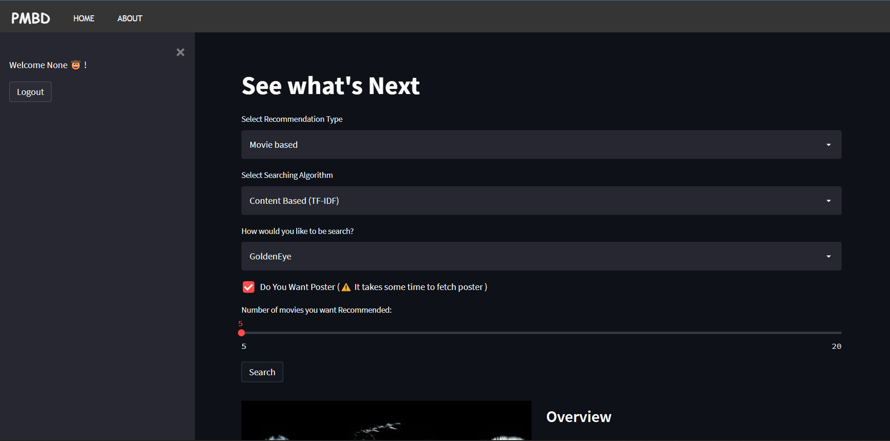
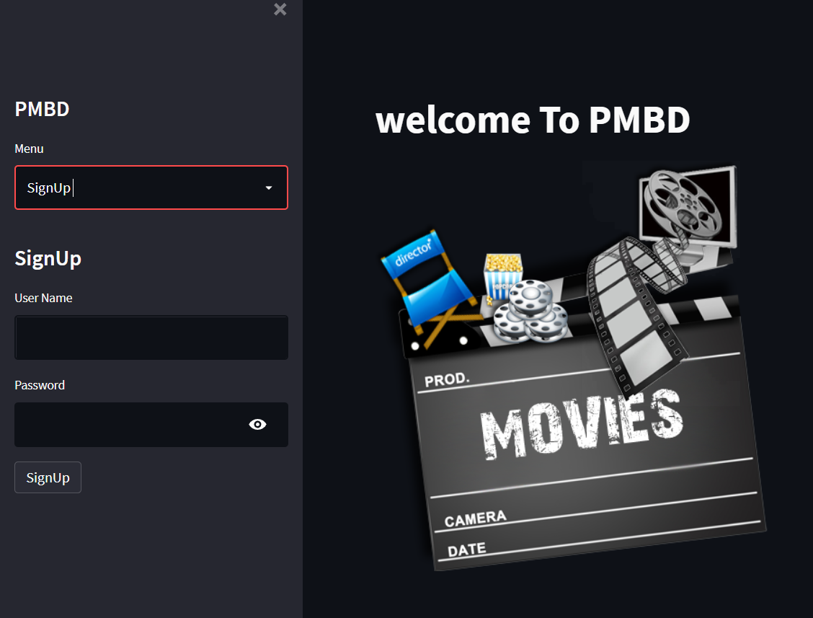
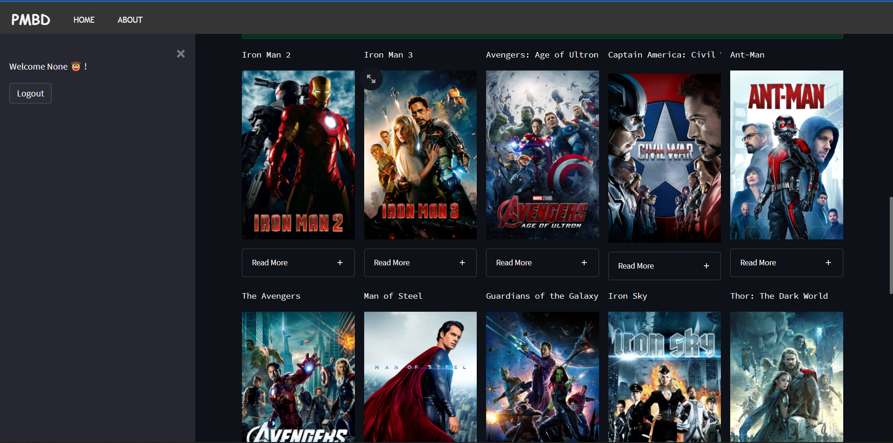

This is the project based on Machine Learning in whcih i have devloped a web application to demonstrate how various Machine Learning algorithms use for recommendation


Demonstrate the use of Recommendation System :
  1. Helps to Improve the on-site experience by creating dynamic recommendations for different kinds of audiences like Netflix does.
  2. Helps to categories the product based on their features. Eg: Material, Season, etc.


### TECH STACK USED
* Python
* Streamlit





First of all you need to **SIGN UP** in the page using ( You can use any username and password for login ):- 
  
   
   
  

### Three Recommendation Type:
<ul>
  <li>Section A: Movie based</li>
  <li>Section B: Person based(cast Member)</li>
  <li>Section C: genres based</li>
</ul>

## Section A: Movie based

In this, a user can select the number of recommendations they want related to a specific movie selected by the movie name.

#### Result with poster



#### Result without poster


### Four Algorithm Type:
<ul>
  <li>Section A.1: Content Based (TF-IDF)</li>
  <li>Section A.2: Content Based (Bag Of Words)</li>
  <li>Section A.3: Item-Item Collaborative Based</li>
  <li>Section A.4: K Nearest Neighbor (Item Based)</li>
</ul>


# Installation

 Make a folder in your system and clone the project using git bash then open the project in Visual Studio Code or any IDE you prefer.

##### Clone the project 
  ```
  git clone https://github.com/Hafi25/Recommendation_System.git

  ```

after cloning the project get into main directory

  `cd .\Recommendation_System\`


 ⚠️ Make sure pip is already installed otherwise check out https://pip.pypa.io/en/stable/installation/
  
 ⚠️ Python version sholud be `3.9.12` or higher ( if you want to download then check out https://www.python.org/downloads/ )
  
  
now install all library

`pip install -r requirements.txt`


# Set Up

To open webapp on your local machine

`streamlit run main.py`


--------------------
